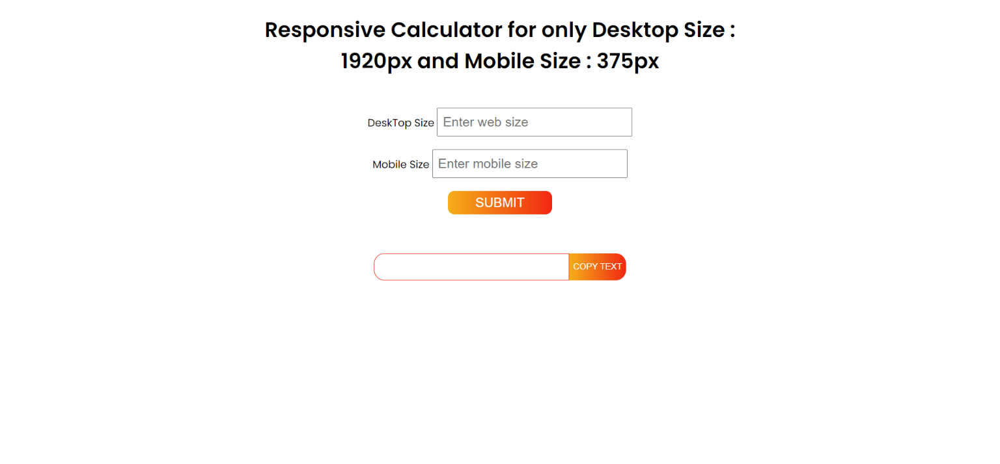

## Responsive Calculator for only Desktop Size : 1920px and Mobile Size : 375px

Live Link - https://yokesh-ks.github.io/JavaScript_Projects/ResponsiveCalculator/



1 rem = 16px;

Desktop Screen Size = 1920px
Mobile Screen Size = 375px

For Responsive We have Two Equation
```
a * rem + b * Desktop Screen = desktop font-size
a * rem + b * Desktop Screen = mobile font-size
```
For Example
```
a * 16 + b * (1920/100) = 22
a * 16 + b * (375/100) = 14
```
We divide by 100 because for 100vw = 1920 so 1vw = 1920/100
Then Substate both equation we can find a and b

a gets cancelled and equation becomes
```
b * (1920 / 100) - b * (375 / 100) = desktop font-size - mobile font-size
```
```
b = (desktop font-size - mobile font-size) / ((1920 / 100) - (375 / 100))
```
after finding b substitute b in above equation we get a
```
a = (desktop font-size - b * (1920 / 100))/16
```
After finding a and substitute in equation
```
calc(a * rem + b * vw)
```
